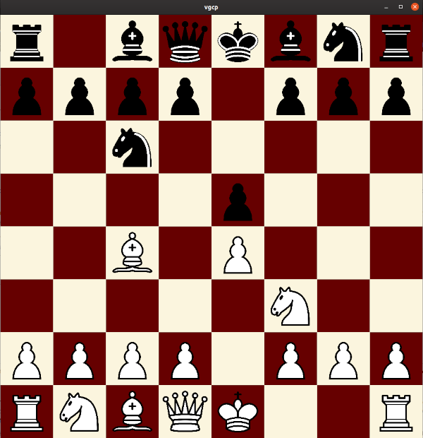
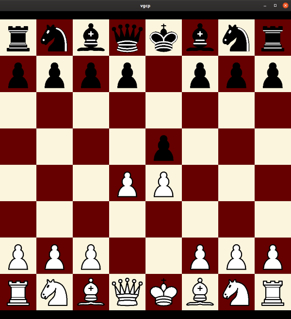
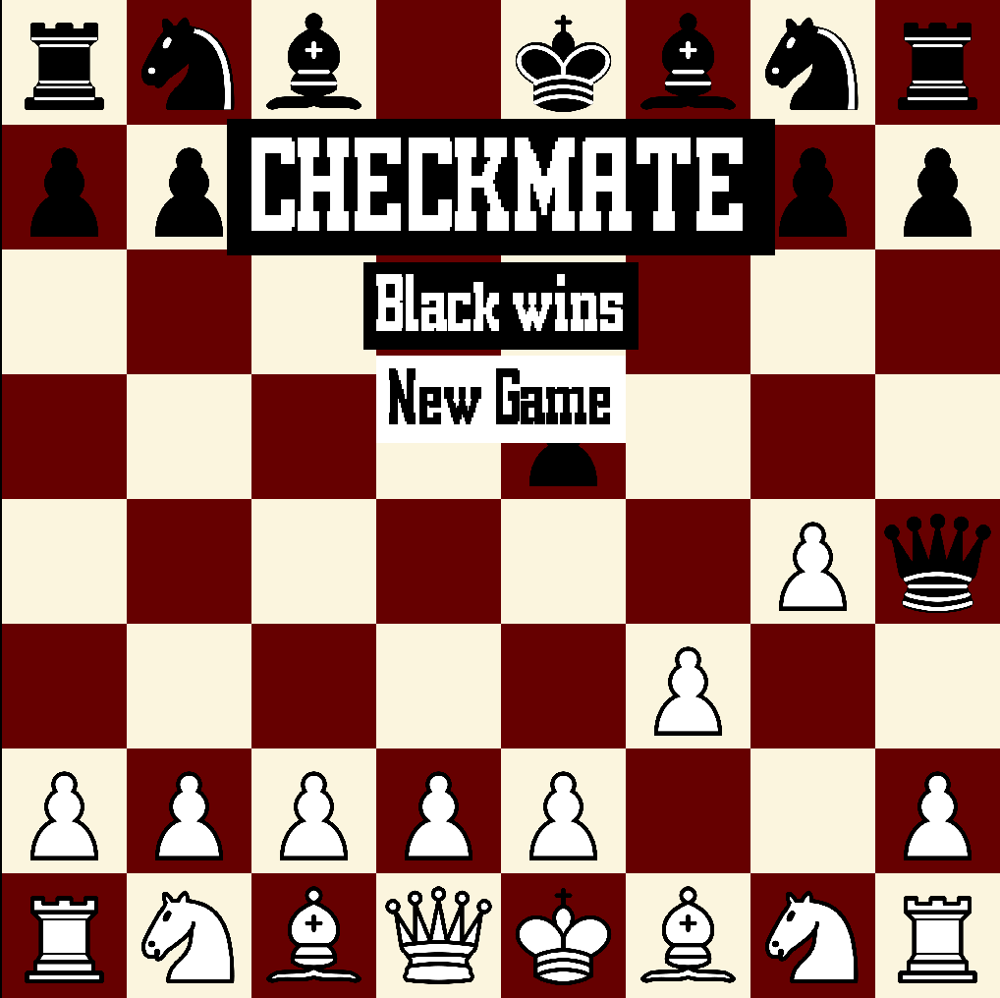
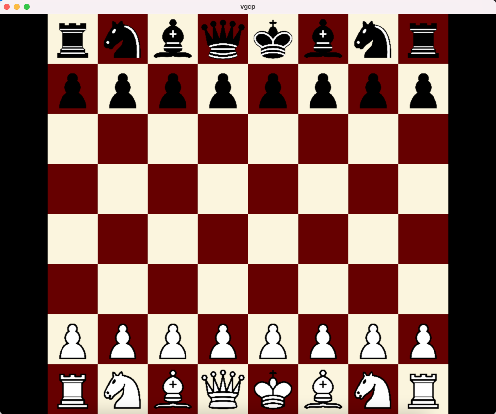

# Victor's Graphical Chess Program

vgcp is a simple graphical chess UI which uses SDL2 and is written in C.

vgcp has been tested on Ubuntu, Void Linux and MacOS.

## Usage 

If you wish to edit the software's (compilation) options then edit the definitions in [include/config.h](include/config.h).

### Without Installation

To compile this program, run ``` make ``` on the ``` vgcp/ ``` directory. To run the program simply run ``` ./vgcp ```.

### Installation

To install this program, first edit the [include/config.h](include/config.h) file and uncomment the ``` _INSTALL ``` definition (``` #define _INSTALL ```). After doing this, simply run ``` sudo make install ``` which will install the program to ``` PREFIX/bin ``` (``` PREFIX ``` is defined in the makefile) and the assets to ``` PREFIX/share/vgcp/``` . Now you can use this program on any directory by typing ``` vgcp ``` on the command line or by finding it on your application menu.

## Features 

Here's a list of currently supported features:

- All chess pieces moving correctly

    - Castling

- Player vs player gameplay

    - Checkmate and victory

- Draw (as a result of a stalemate)


Here's a list of features that will (hopefully) be implemented in the near future:

- En Passant

- Draw as a result of repitition

- Draw as a result of  not enough pieces (for checkmate)

- Support for some chess protocol

    - Player vs computer gameplay

## Screenshots

### vgcp on GNU/Linux





### vgcp on MacOS



## Credits

The chess pieces were made by the Wikipedia user [Cburnett](https://en.wikipedia.org/wiki/User:Cburnett), see [assets/pieces/license.txt](assets/pieces/license.txt) for details. The [font](https://fontstruct.com/fontstructions/show/55273) that the game uses was made by Axel Leyer, see [assets/font/license.txt](assets/font/license.txt) and [assets/font/readme.txt](assets/font/readme.txt) for details.

The program was tested on MacOS and the MacOS screenshots were provided by Github user [kaikkitietokoneista](https://github.com/kaikkitietokoneista)
